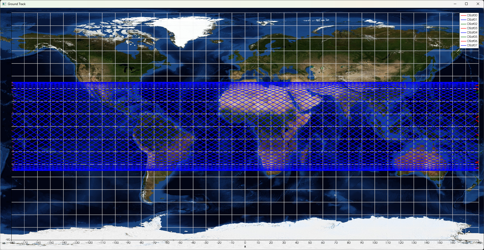

# Results validation - CYGNSS constellation
## Reference
[eoportal](https://www.eoportal.org/satellite-missions/cygnss#CYGNSS.html.20) reports the following information regarding the CYGNSS constellation:

- Altitude = $510 \ km$
- Inclination = $35 ^\circ$
- Period = $90$ minutes
- Swath = $1480$ km (cameraAngle = $70.9863$)
- $8$ microsats orbiting in pairs with an orbital separation between pairs of $12$ minutes ($0.2 ^\circ$)
- Median revisit time $\approx \ 2$ hours 
- Mean revisit time $\approx \ 6$ hours

## Results
Taking into consideration Puerto Rico's territory (following ` territory.geojson `):

```
{
  "type": "FeatureCollection",
  "features": [
    {
      "type": "Feature",
      "properties": {},
      "geometry": {
        "coordinates": [
          [
            [
              -67.36054702427634,
              18.603248124257206
            ],
            [
              -67.36054702427634,
              17.77172773786721
            ],
            [
              -65.52783907545542,
              17.77172773786721
            ],
            [
              -65.52783907545542,
              18.603248124257206
            ],
            [
              -67.36054702427634,
              18.603248124257206
            ]
          ]
        ],
        "type": "Polygon"
      }
    }
  ]
}


```

After running the simulation the following results where obtained:

- Median revisit time = $1.56$ hours
- Mean revisit time = $4.74$ hours

### Constellation ground track (4 days)

